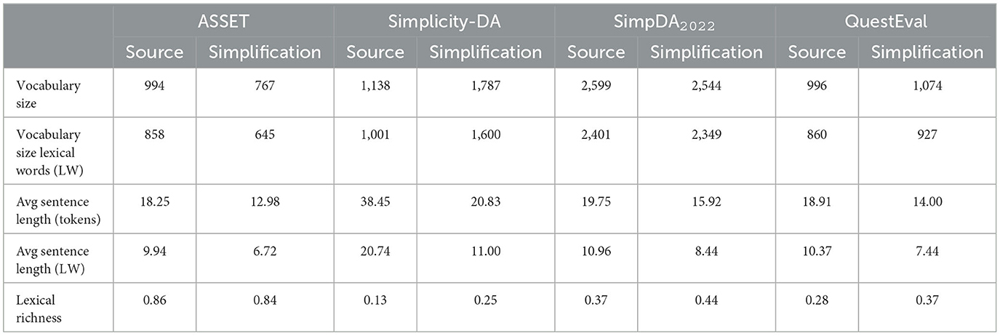

# Repository for the "Continuous Scale Meaning Dataset" Proposed in "[MeaningBERT: Assessing Meaning Preservation Between Sentences](https://www.frontiersin.org/articles/10.3389/frai.2023.1223924/full)"

## About the Dataset

CSMD was created for [MeaningBERT: Assessing Meaning Preservation Between Sentences](https://www.frontiersin.org/articles/10.3389/frai.2023.1223924/full).

It contains 1,355 English text simplification meaning preservation annotations. Meaning preservation measures how well the meaning of the output text corresponds to the meaning of the source ([Saggion, 2017](https://link.springer.com/book/10.1007/978-3-031-02166-4)).

The annotations were taken from the following four datasets: 

- [ASSET](https://aclanthology.org/2020.acl-main.424/)
- [QuestEVal](https://arxiv.org/abs/2104.07560),
- [SimpDa_2022](https://aclanthology.org/2023.acl-long.905.pdf) and,
- [Simplicity-DA](https://direct.mit.edu/coli/article/47/4/861/106930/The-Un-Suitability-of-Automatic-Evaluation-Metrics).

It contains a data augmentation subset of 1,355 identical sentence triplets and 1,355 unrelated sentence triplets (See the "Sanity Checks" section (3.3.) in our [article](https://www.frontiersin.org/articles/10.3389/frai.2023.1223924/full)).

It also contains two holdout subsets of 359 identical sentence triplets and 359 unrelated sentence triples (See the "MeaningBERT" section (3.4.) in our [article](https://www.frontiersin.org/articles/10.3389/frai.2023.1223924/full)).

### Statistics
Aggregate statistics on textual data of the four datasets used to create "Continuous Scale Meaning Dataset".


Aggregate statistics on meaning preservation rating data using a continuous scale (0–100) for the four datasets used to
create "Continuous Scale Meaning Dataset".


# Dataset Structure

### Data Instances

- `Meaning` configuration: an instance consists of 1,355 meaning preservation triplets (Document, simplification, label).
- `meaning_with_data_augmentation` configuration: an instance consists of 1,355 meaning preservation triplets (Document, simplification, label) along with 1,355 data augmentation triplets (Document, Document, 100) and 1,355 data augmentation triplets (Document, Unrelated Document, 0) (See the sanity checks in our [article](https://www.frontiersin.org/articles/10.3389/frai.2023.1223924/full)).
- `meaning_holdout_identical` configuration: an instance consists of 359 meaning holdout preservation identical triplets (Document, Document, 1) based on the ASSET Simplification dataset.
- `meaning_holdout_unrelated` configuration: an instance consists of 359 meaning holdout preservation unrelated triplets (Document, Unrelated Document, 0) based on the ASSET Simplification dataset.

### About the Data Augmentation

#### Unrelated Sentence
We have changed the data augmentation approach for the unrelated sentence. Instead of generating noisy sentences using an LLM, for each of the 1,355 sentences, we sample a sentence in the unlabeled sentence in ASSET (non included in the holdout nor the labelled sentence). We compute the  Rouge1, Rouge2, RougeL and bleu scores to validate that the sentences are unrelated in terms of vocabulary. Namely, each metric score is below 0.20 or 20 for Bleu for all pairs. If a pair achieves a higher value, we select another sentence from ASSET to create a pair and reapply the test until a pair achieves a score below 0.20/20.

#### Commutative Property
Since meaning preservation is a commutative function, i.e., Meaning(Sent_a, Sent_b) = Meaning(Sent_b, Sent_a), we also include the commutative version of the triplet in the data augmentation version of the dataset for sentences that are not identical.

### Data Fields

- `original`: an original sentence from the source datasets.
- `simplification`:  a simplification of the original obtained by an automated system or a human.
- `label`: a meaning preservation rating between 0 and 100.

### Data Splits
The split statistics of CSMD are given below.

| | Train    | Dev    | Test | Total |
| ------ | ------   | ------ | ---- | ----- |
| Meaning | 853    | 95   | 407  | 1,355  |
| Meaning With Data Augmentation | 2,560    | 285   | 1,220  | 4,065  |
| Meaning Holdout Identical | NA    | NA   | 359  | 359 |
| Meaning Holdout Unrelated | NA    | NA   | 359  | 359  |

All the splits are randomly split using a 60-10-30 split with the seed `42`.

## Download the dataset

You can manually download our dataset splits available in `dataset`, or you can use the HuggingFace dataset class as follows:

```python
from datasets import load_dataset

dataset = load_dataset("davebulaval/CSMD", "meaning")

# you can use any of the following config names as a second argument:
# "meaning", "meaning_with_data_augmentation", "meaning_holdout_identical", "meaning_holdout_unrelated"
```

## To Cite

```
@ARTICLE{10.3389/frai.2023.1223924,
AUTHOR={Beauchemin, David and Saggion, Horacio and Khoury, Richard},   
TITLE={{MeaningBERT: Assessing Meaning Preservation Between Sentences}},      
JOURNAL={Frontiers in Artificial Intelligence},      
VOLUME={6},           
YEAR={2023},      
URL={https://www.frontiersin.org/articles/10.3389/frai.2023.1223924},       
DOI={10.3389/frai.2023.1223924},      	
ISSN={2624-8212},   
}
```

